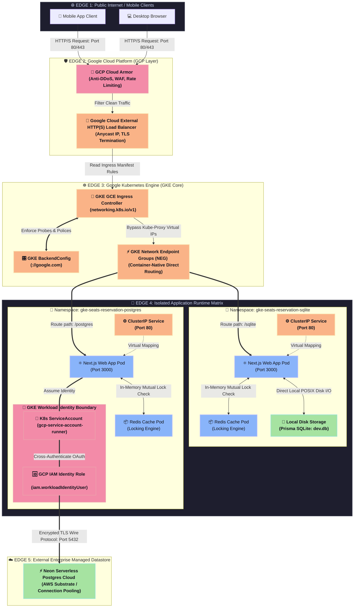

# Seats Reservation Platform

## 🌐 Public GCP & GKE Demostration

| Demo Version(s) | Demo Link(s) |
| :--- | :--- |
| **GCP SQLite** | <!-- START-gcp-seats-reservation-sqlite --> [https://seats-reservation-sqlite-2omkqplgya-uc.a.run.app](https://seats-reservation-sqlite-2omkqplgya-uc.a.run.app)<br> *(Last updated: Sat Jun 27 16:51:58 UTC 2026)* <!-- END-gcp-seats-reservation-sqlite --> |
| **GCP Postgres** | <!-- START-gcp-seats-reservation-postgres --> [https://seats-reservation-postgres-2omkqplgya-uc.a.run.app](https://seats-reservation-postgres-2omkqplgya-uc.a.run.app)<br> *(Last updated: Sat Jun 27 16:51:58 UTC 2026)* <!-- END-gcp-seats-reservation-postgres --> |
| &nbsp; | &nbsp; |
| **GKE SQLite** | <!-- START-gke-seats-reservation-sqlite --> [http://35.226.149.88:80](http://35.226.149.88:80)<br> *(Last updated: Sun Jun 28 07:01:57 UTC 2026)* <!-- END-gke-seats-reservation-sqlite --> |
| **GKE Postgres** | <!-- START-gke-seats-reservation-postgres --> [http://136.114.146.251:80](http://136.114.146.251:80)<br> *(Last updated: Sun Jun 28 07:01:57 UTC 2026)* <!-- END-gke-seats-reservation-postgres --> |

## 🔥 Prometheus Metrics Dashboard Demostration

- **Captured Prometheus Dashboard**: <!-- START-prometheus-metrics-dashboard-assets --><!-- END-prometheus-metrics-dashboard-assets -->

- **Prometheus Dashboard**: <!-- START-prometheus-metrics-dashboard --> [https://shortisthmus2724.grafana.net/public-dashboards/2b25c4d279144bcd82aec3f6d3328f80](https://shortisthmus2724.grafana.net/public-dashboards/2b25c4d279144bcd82aec3f6d3328f80)<br> *(Last updated: Mon Jun 29 15:45:36 UTC 2026)* <!-- END-prometheus-metrics-dashboard -->

## ⚙️ GitHub CI/CD Main Workflow

| GitHubCI/CD Workflows | Latest Running Status(es) |
| :--- | :--- |
| **🚢 Seats Reservation Platform CI/CD Pipeline** |  |

## 🏛️ 1. Technical Decisions & Architecture
- **Concurrency Control**: DB level transactional isolation to completely eliminate double-booking at the exact same millisecond.
- **Session Duration**: Mandated 90-day expiry using HTTP-Only JWT tokens for security.
- **Resiliency & Fault Tolerance**: Includes a 5-minute timeout window pattern on pending seats to gracefully release deadlocks if users abandon the payment popup screen.


---

## 🔐 2. Authentication & Identity Management Architecture

The platform implements a highly resilient, hybrid identity management architecture controlled via a **Dynamic Feature Toggle (`AUTH_PROVIDER`)**. This architecture supports runtime switching between two enterprise-grade authentication modes:
1. **Cloud-Native Mode (`firebase`)**: Offloaded authentication utilizing the Firebase Session Cookie Pattern.
2. **Self-Managed Mode (`custom`)**: An in-house, dual-token infrastructure featuring cryptographic isolation and token rotation.

---

### ☁️ Mode 1: Cloud-Native Identity (Firebase Session Cookie Pattern)
To eliminate the security vulnerabilities of standard client-side SDK implementations—where ID tokens stored in LocalStorage are exposed to Cross-Site Scripting (XSS) attacks—this platform strictly enforces the **Server-Side Session Cookie Pattern**.

* **Token Exchange**: The frontend SDK captures a short-lived Firebase `IdToken` and transmits it to the Next.js backend. The `firebase-admin` SDK validates the token and exchanges it for a secure, HTTP-Only Session Cookie with a 14-day validity window.
* **Zero Layout Flickering**: Because sessions are decrypted server-side during the initial page request, the platform avoids the 1-2 second UI flickering typical of client-side `onAuthStateChanged` hooks. This ensures instant hydration of the user's `SELECTED` seat states and active countdown timers upon browser refreshes.
* **Operational Decoupling**: Offloading brute-force protection, password encryption, and account recovery to Google's infrastructure allows the platform's core to dedicate 100% of its resources to ACID-isolated concurrent seat allocation.

#### 🛡️ Client-Side Firebase API Key Security Disclosure
The client-side `apiKey` utilized within the Firebase Client configuration differs fundamentally from conventional API keys, which are typically used to restrict backend resources. Instead, it functions purely as a public **Project Identifier** that enables the frontend application to route requests to the designated Google infrastructure.

Data confidentiality and operational integrity (including read/write loops and state mutations within the seat reservation matrix) are strictly enforced via standard defensive layers:
1. **Server-Side Session Verification**: Authenticated through `firebase-admin` via secure, HTTP-Only session cookies.
2. **Database Integrity**: Protected by server-managed ACID transactions that eliminate concurrent race conditions.

Consequently, exposing the `apiKey` within the client-side bundle complies with Google’s architectural specifications and introduces zero vulnerability to the core security posture of the platform.

#### 📊 Client-Side Telemetry & Firebase Analytics Integration

The platform integrates **Firebase Analytics** to capture user behavioral metrics and conversion funnels (such as seat selections and checkout completions) without introducing render-blocking delays to the UI.

To prevent build-time failures and server runtime crashes during Next.js Pre-rendering (SSR), the application implements a strict **Isomorphic Safe Initialization Pattern**:
1. **Runtime Context Guard**: The initialization query is explicitly wrapped within a `typeof window !== "undefined"` conditional block, insulating the Node.js server context from web-browser-native variables.
2. **Feature Support Verification**: Utilizes Firebase’s asynchronous `isSupported()` interface to safely suppress tracking on strict storage environments, legacy browsers, or aggressive stealth/incognito viewports.
3. **Out-of-Band Event Dispatching**: High-value client events (e.g., `purchase_seats`) are dispatched asynchronously using non-blocking telemetry primitives, decoupled from the critical path of the local transactional database state machine.

---

### 🛡️ Mode 2: Self-Managed Identity (Dual-Token JWT & Cryptographic Isolation)
When operating in decoupled or on-premise environments, the platform switches to a custom, zero-dependency identity layer engineered for high security and performance.

* **Cryptographic Hardening**: Password data is transformed into mathematically un-verifiable hashes using **Bcrypt** with a computational work factor of 10 (`SALT_ROUNDS`). This proactively thwarts rainbow-table and high-throughput GPU brute-force attempts.
* **Dual-Token Pipeline**:
  * **Access Token**: A short-lived JWT (15-minute expiry) benched with standard cryptographic signatures (`HS256`), attached to backend mutation requests.
  * **Refresh Token**: A long-lived token (90-day expiry) encapsulated within an HTTP-Only Cookie and cross-referenced with a secure database whitelist.
* **Silent Token Rotation**: When the short-lived Access Token expires, the backend automatically triggers a silent refresh handshake. It validates the client's Refresh Token against the database snapshot; if valid, a new Access Token is minted transparently without interrupting the user's active seating countdown.
* **Instant Session Revocation**: Storing the Refresh Token string directly in the database gives administrators an instant kill-switch. By setting the token to `null` in the user's row, any active session is immediately revoked on its next rotation attempt, enforcing strict state control.

---

### 🎛️ Hybrid Architecture Governance
Both authentication subsystems converge into a single defensive interface (`verifyAccessToken()`). All downstream seat booking endpoints—such as `/api/reserve/hold` and `/api/reserve`—interact with this unified contract, remaining entirely agnostic of the underlying auth provider. This strict separation of concerns allows developers to swap the entire identity core via environment variables (`.env`) without refactoring a single line of business logic.

---

## 💻 3. Local Setup Instructions
1. Clone the project and install packages:
   ```bash
   npm install
   ```
2. Initialize SQLite Database & Seed some sample seats:
   ```bash
   npx prisma db push
   ```
3. Run Seed Script (or execute inside your db tool) to create 3 seats: `SEAT-1`, `SEAT-2`, `SEAT-3`.
4. Start development web server:
   ```bash
   npm run dev										# no seeding sample data - DEV mode
   or npm run dev_seed								# with seeding sample data - DEV mode
   ```
5. Open browser at `http://localhost:3000` to evaluate.
6. Optional: you could run by MS DOS batch under Windows platform
   ```bash
   # DEV Mode
   run-dev.bat build								# MS Dos batch script (included step 1,2) without seeding sample data / with build to install dependencies
   or run-dev-seed.bat build						# MS Dos batch script (included step 1,2) with seeding sample data (user: hainguyenjc@gmail.com; password: password123) / with build to install dependencies

   # PROD Mode
   run-prod.bat build								# MS Dos batch script (included step 1,2) without seeding sample data / with build to install dependencies
   or run-prod-seed.bat build						# MS Dos batch script (included step 1,2) with seeding sample data (user: hainguyenjc@gmail.com; password: password123) / with build to install dependencies
   ```
7. Optional (Docker/K8s): you could run by MS DOS batch to deploy and run under Docker/K8s platform
   ```bash
   # Compose up
   docker-compose-up.bat							# for SQLite		- build image with cache
   or docker-compose-up.bat postgres				# for PostgreSQL	- build image with cache
   docker-compose-up.bat sqlite --no-cache			# for SQLite		- build image without cache, fresh build
   or docker-compose-up.bat postgres --no-cache		# for PostgreSQL	- build image without cache, fresh build
   
   # Compose down
   docker-compose-down.bat							# for SQLite
   or docker-compose-down.bat postgres				# for PostgreSQL
   ```

---

## 💳 4. Payment Webhook Reliability & Fallback Architecture

### 4.1. Current Staging Implementation
The platform currently utilizes a client-triggered proxy (`mockPaymentSuccess`) within the `/api/reserve` endpoint to simulate payment outcomes. While highly efficient for local integration testing and instant state transition verification, this synchronous approach introduces a single point of failure and does not meet enterprise production standards for asynchronous financial reconciliation.

### 4.2. Production-Ready Target Architecture: Idempotent Event-Driven Webhook
To ensure **100% financial reliability, network fault tolerance, and eventual consistency**, the production blueprint replaces the mock layer with an asynchronous, decoupled Webhook architecture integrated with payment gateways (e.g., Stripe, PayPal, or local banking APIs).

```text
+----------------+      1. Hold Seat      +------------------+      2. Checkout Session     +-----------------+

|   Web/Mobile   | ---------------------> |  Next.js Server  | ---------------------------> | Payment Gateway |
+----------------+                        +------------------+                              +-----------------+
        ^                                           |                                                |

        |                                           | 4. Update State                                | 3. Webhook Event
        +-------------------------------------------+ <----------------------------------------------+
                                                  (ACID/Idempotent)
```

---

### 🛡️ 4.3. Core Reliability & Resiliency Patterns

#### 4.3.1. Strict Idempotency Layer (Duplicate Event Protection)
Payment gateways often guarantee **At-Least-Once delivery**, meaning the same webhook event (e.g., `payment_intent.succeeded`) can be fired multiple times due to network retries.
* **Implementation**: The backend introduces an idempotency verification layer using a unique `PaymentIntentID` or `TransactionID` as a locking key.
* **Mechanism**: Before processing mutations inside the database transaction, the server performs a check-and-set operation. If the transaction ID is already flagged as `COMPLETED` or `FAILED`, the server immediately skips execution and returns a `200 OK` handshake response to the gateway, preventing duplicate billing or multiple seat assignments.

#### 4.3.2. Cryptographic Webhook Signature Verification
To thwart **Replay Attacks** and prevent malicious actors from spoofing successful payment payloads to unblock seats without paying:
* The server extracts the `X-Webhook-Signature` header from the incoming request.
* Using a secure, server-side environment secret (`WEBHOOK_SIGNING_SECRET`), the runtime recalculates the HMAC-SHA256 checksum of the raw request body.
* The hook is strictly rejected with a `400 Bad Request` if the computed signature does not perfectly match the header payload.

#### 4.3.3. Dead-Letter Queue (DLQ) & Retry Fallback Mechanics
Network instability or transient database deadlocks can cause webhook ingestion to fail mid-flight.
* **Exponential Backoff**: The system relies on the payment gateway's native exponential backoff retry mechanism (e.g., retrying 3 to 5 times over 24 hours).
* **Decoupled Message Broker**: In ultra-high-concurrency scenarios, the webhook landing endpoint acts as a lightweight producer that shoots raw event payloads into a durable message queue (such as **RabbitMQ**, **AWS SQS**, or **Kafka**).
* **DLQ Remediation**: If a message fails ingestion after maximum retry attempts, it is quarantined inside a **Dead-Letter Queue (DLQ)**. This triggers an automated alert to operators for manual audit or programmatic fallback correction without dropping customer data.

#### 4.3.4. Asynchronous State Reconciliation (The Ultimate Fallback)
If a payment gateway suffers a catastrophic outage and fails to fire webhooks entirely, the platform’s **Passive Sweeper Logic** (`/api/seats`) and **Active Background Worker** (`/api/release`) act as safety nets [^2, 3]:
* **Reconciliation Cron**: A scheduled server cron job runs every 10 minutes to query the payment gateway's data logs for any bookings stuck in a permanent `PENDING` state.
* **State Harmonization**: If the gateway logs report the payment was successful but no webhook arrived, the cron programmatically transitions the seat to `BOOKED` and completes the order [^2], maintaining absolute eventual consistency across all edge distributed node clusters.

---

## 🕵️ 5. Audit Logging for Financial & Critical Mutations

### 5.1. Architectural Mandate
To comply with enterprise security auditing, financial reconciliation, and anomaly detection standards, the platform features an asynchronous, **Append-Only Audit Logging Infrastructure**. 

This component acts as an immutable ledger designed to monitor and store data related to high-risk business state changes without introducing performance overhead to the primary seating pipeline.

---

### 🛡️ 5.2. Core Audit System Specifications

#### 5.2.1. Tamper-Proof & Append-Only Topology
* **Structural Isolation**: The `AuditLog` database entity behaves as a data-sink. The backend service architecture purposefully exposes no `Update` or `Delete` endpoints for this model.
* **Fail-Safe Mechanism**: The logging layer is isolated with dedicated error-handling boundaries. If the storage persistence layer of the log fails, the core system gracefully intercepts the error, emits a system warning (`console.error`), and permits the user’s primary financial transaction to proceed uninterrupted.

#### 5.2.2. Deep Network Forensics & IP Traversal
To enforce non-repudiation and defend against malicious automated scripts or distributed attacks, the logger extracts metadata passing through Kubernetes Ingress or reverse-proxies:
* It reads headers like `X-Forwarded-For` and `X-Real-IP`.
* In multi-proxy routing environments, it programmatically parses the composite string to isolate the origin client IP address.

#### 5.2.3. Structured Behavioral Telemetry
Each generated log captures a strict, standardized state dictionary:
* `action`: High-level operational type classification (`HOLD_SEAT`, `PAYMENT_SUCCESS`, `PAYMENT_FAILED`).
* `target`: Clear text representation of the mutated resources (e.g., `Seats: seat-1, seat-2`).
* `details`: A comprehensive JSON payload capturing contextual data, exception trace messages, or raw webhook identifiers for subsequent cross-referencing.

---

## ❓ 6. Architectural Q&A: Session Management & Future Mobile App Support

### ❓ 6.1. Question:
**Does the current session approach have the ability to handle a mobile app integration in the future?**

### 💡 6.1. Answer:
**Yes, absolutely.** The core authentication architecture of this platform was engineered from day one to be completely **stateless and API-first**, ensuring seamless horizontal scalability across multiple client channels, including **Web, iOS, Android, and third-party API integrations**.

---

### 🧠 6.1. Detailed Architectural Scalability & Implementation Strategy

To satisfy enterprise-grade mobile requirements, the platform deliberately avoids traditional, stateful server-side sessions (such as Redis-backed or sticky session stores). Instead, it implements a strict **Stateless Dual-Token Framework (JWT Access Token + Refresh Token)**:

#### 6.1.1. Decoupled Token Storage Strategy
While the Web client securely encapsulates tokens within `HTTP-Only, SameSite=Lax` Cookies to mitigate Cross-Site Scripting (XSS) and Cross-Site Request Forgery (CSRF) vulnerabilities, the mobile client is decoupled from browser-native cookie management:
* **iOS / Android Clients**: Mobile applications will receive the exact same cryptographic tokens (Access & Refresh JWTs) in the JSON payload response during the authentication handshake.
* **Secure Device Hardware**: The mobile application will securely persist these tokens inside hardware-backed keychains (e.g., **iOS Keychain Services** or **Android Keystore / EncryptedSharedPreferences System**).
* **Authorization Headers**: For subsequent resource requests or seat matrix mutations, the mobile client will attach the Access Token inside the standard HTTP `Authorization: Bearer <JWT>` header, ensuring total compatibility with the existing backend parsing logic.

#### 6.1.2. Cross-Platform Token Rotation Loop
The backend's **Silent Token Rotation** endpoint (`/api/auth/refresh`) is completely decoupled from Web context [^8]:
* When a mobile user’s short-lived Access Token expires (15-minute window), the mobile networking layer (e.g., Axios Interceptors or Retrofit Authenticator) will automatically catch the `401 Unauthorized` status.
* The client will fire a headless POST request containing the Refresh Token to the rotation endpoint.
* Once cross-referenced with the database whitelist, the server mints a new token pair and returns it in the response body [^8]. This guarantees a zero-friction, uninterrupted seat booking experience on mobile devices.

#### 6.1.3. API-First Architecture Readiness
Because the backend endpoints—such as `/api/reserve/hold` and `/api/reserve`—rely entirely on a stateless contract contract interface (`verifyAccessToken()`), they are fully agnostic of the client’s architecture. 

```text
+-----------------------+      (HTTP-Only Cookie)      +---------------------------------+

|       Web App         | <--------------------------> |                                 |
+-----------------------+                              |                                 |

                                                       |      Next.js API Gateway        |
+-----------------------+    (Authorization Header)    |  (Stateless Token Verification) |

|   Mobile App (iOS)    | <--------------------------> |                                 |
+-----------------------+                              +---------------------------------+
```

#### 6.1.4. Unified Firebase Support for Mobile
When operating in Cloud-Native Mode (`AUTH_PROVIDER="firebase"`), migrating to mobile introduces zero backend friction. The native iOS/Android Firebase SDKs will authenticate users directly against Google OAuth endpoints. The generated `IdToken` will then be transmitted to our API gateway via raw request bodies to establish the same verified session context.

---

### 🏁 6.1. Summary of Architectural Alignment
By adopting a **Stateless Token Pipeline** rather than traditional server-bound cookie sessions, the platform eliminates infrastructure lock-in. This delivers a unified, production-ready backend capable of powering responsive desktop layouts and native mobile viewports under a single, shared security blueprint.

---

### ❓ 6.2. Question:
**How would you handle a failed webhook from the payment gateway?**

### 💡 6.2.Answer:
Handling a failed webhook requires a multi-layered defensive strategy to ensure **eventual consistency** and prevent deadlocks (where a seat remains permanently locked in `PENDING` status or a user pays but never gets their seat) [^2, 3]. 

The platform guarantees data reconciliation and transactional recovery through four coordinated engineering patterns:

#### 6.2.1. Native Exponential Backoff Retries
Most modern payment gateways (e.g., Stripe, Adyen) do not expect an immediate single handshake. If our server fails to return a `200 OK` response due to transient network drops or database lock contention, the gateway automatically queues the webhook for retry using an exponential backoff strategy (e.g., retrying up to 3–5 times over a 24-hour window). 
* *System Behavior*: Our endpoint relies on an **Idempotency Layer**. If a previous partial transaction failed and rollbacked, the subsequent retry will safely execute the query from scratch without side effects.

#### 6.2.2. Event Ingestion via Durable Message Broker (Queue Decoupling)
In a high-concurrency production scenario, the webhook landing endpoint does not process business logic or communicate with the database directly. 
* *Mechanism*: The HTTP POST request simply pushes the raw payload into a message broker (such as **RabbitMQ** or **AWS SQS**). 
* *Failure Mitigation*: If our Next.js backend crashes or suffers a temporary outage, the message remains safely persisted inside the queue. Once the backend services recover, they consume the message from the queue sequentially, ensuring no user financial events are permanently dropped [^8].

#### 6.2.3. Proactive Self-Healing & Asynchronous Sweep Logic (The Ultimate Fallback)
If the payment gateway suffers an internal disaster and completely fails to broadcast webhooks, the system activates its dual passive/active sweeping architecture to prevent seating state deadlocks [^2, 3]:
* **Passive Evaluation on Request**: Every time any user hits the `/api/seats` endpoint, the server runs a sub-millisecond query to locate any `PENDING` bookings that have outlived their 5-minute lifespan (`expiresAt < NOW()`) and automatically reverts those seats back to `AVAILABLE` [^2, 3].
* **Active Reconciliation Cron (Out-of-Band Sync)**: A scheduled microservice worker runs every 10 minutes, pulling all `PENDING` rows close to expiration. It makes an outbound secure REST API request directly to the payment gateway's logs (e.g., GET `/v1/payment_intents/id`) to verify the factual status. If the gateway reports the transaction was successful, our script bypasses the missing webhook, upgrades the seat to `BOOKED`, and confirms the order [^2].

#### 6.2.4. Dead-Letter Queue (DLQ) & Observability Guardrails
If a webhook payload contains malformed data or fails processing after maximum message broker retries, it is quarantined inside a **Dead-Letter Queue (DLQ)**.
* *Alerting*: The mutation triggers an automated Slack/PagerDuty notification to the DevOps team.
* *Governance Tooling*: Administrative operators can access a secure internal dashboard to review the structural anomaly of the isolated payload and trigger a manual, programmatic force-sync once the underlying data structure issue is remediated.

---

## 🤖 7. Automated End-to-End (E2E) Testing Suite

The platform packages a production-ready **Playwright** automation suite to perform end-to-end regression testing on the core distributed business state machine.

| GitHubCI/CD Workflows | Latest Running Status(es) |
| :--- | :--- |
| **🚀 [ TEST ] Seats Reservation Platform CI/CD Pipeline** |  |

### 7.1. Test Coverage Blueprint
The automated matrix simulates headless user actors to validate non-deterministic edge scenarios:
1. **Defensive Authorization Barrier**: Verifies the dynamic locking layer blocks access to the database seating configuration for unauthenticated connections.
2. **Concurrent Multi-Select Mechanics**: Automates multi-row selection, verifying asynchronous array parsing (`seatIds`) across runtime memory.
3. **Reactive Telemetry & Timeouts**: Decodes regex timestamp primitives to ensure the countdown timer accurately hooks into the server-defined `expiresAt` window.
4. **State Machine Transitions**: Simulates the payment reconciliation loop, executing cross-platform verification that successful gates transition seats to disabled `BOOKED` structures, while failures gracefully execute rollback workflows.

### 7.2. Execution Instructions
To execute the automated regression test matrix locally, instantiate the test runner via:
```bash
# Install framework binaries
npm install

# Run the test matrix in headless parallel threads
npx playwright test

# Launch the visual reporting dashboard
npx playwright show-report
```

### 7.3. Test Result
1. Running 2 tests using 1 worker
  2 passed (4.2s)

2. To open last HTML report run:
  ```bash
  npx playwright show-report
  ```

---

# 🚀 8. AUTOMATED CI/CD PIPELINE (GITHUB ACTIONS)

This section documents the continuous integration and deployment pipeline configured via GitHub Actions. The workflow handles isolated unit/E2E testing, automated image compilation, safe registry pushes, and deployment rollback controls on Google Cloud Platform (GCP).

| GitHubCI/CD Workflows | Latest Running Status(es) |
| :--- | :--- |
| **🐳 [ DOCKER ] Seats Reservation Platform CI/CD Pipeline** |  |
| **☁️ [ GCP Deployment ] Seats Reservation Platform CI/CD Pipeline** |  |

---

## 🛠️ 8.1. Pipeline Lifecycle Overview

The complete automation pipeline runs inside a single-job host runner ecosystem to guarantee consistent, sequential data layers from local database seed generation to live cloud deployment.# 📊 Trạng thái CI/CD Pipelines dự án

```text
[ Git Push to Master ] ──> [ Setup Node.js & Services ]
                                │
                                ▼
                 ┌──────────────────────────────────┐
                 │    Step 1: E2E Test Suite   		│
                 │    ├─ SQLite/PostgreSql & Redis	│
                 │    ├─ Seed Sample Data      		│
                 │    └─ Run Playwright E2E    		│
                 └──────────────┬───────────────────┘
                                │
                        ( All Tests Pass )
                                │
                                ▼
                 ┌──────────────────────────────────────────────────────────────────┐
                 │ Step 2: Build & Push Image to DockerHub as Public   				│
                 │    ├─ Manual Trigger (Required to avoid exceeding images qouta)	│
                 │    ├─ Compose Up Docker Image					   				│
                 │    ├─ Auth to Docker Hub    						   				│
                 │    └─ Push Image to DockerHub   					   				│
                 └──────────────┬───────────────────────────────────────────────────┘
                                │
                      ( Push Successful )
                                │
                                ▼
                 ┌──────────────────────────────────────────────────────────────────┐
                 │    Step 3: GCP Deployment   										│
                 │    ├─ Manual Trigger (Required to avoid exceeding images qouta)	│
                 │    ├─ Auth via Google ADC (Google OAuth2 ADC JSON Key Secret)	│
                 │    ├─ Deploy image from DockerHub to GCP Cloud Run				│
                 │    ├─ Check GCP Deployment Service Status						│
                 │    └─ Rollout GKE / Cloud Run									│
                 └──────────────────────────────────────────────────────────────────┘
```

---

## 📝 8.2. Detailed Action Executions

### 🔹 8.2.1: Automated E2E Testing Pipeline
* **Purpose:** Ensures the Next.js App Router and dynamic high-concurrency systems are verified stable before any cloud shipment occurs.
* **Environment Provisioning:** Spawns decoupled sidecar services inside the host runner (localhost interface):
  * **PostgreSQL Server:** Syncs structural data layers via npx prisma db push.
  * **Prisma Data Seeding:** Executes npx tsx prisma/seed.ts (leveraging lightweight TypeScript execution) to eliminate flaky tests caused by missing runtime structures.
  * **Redis Cache Infrastructure:** Spins up memory clusters to isolate active seat-holding sessions during parallel simulations.
* **Automation Suite:** Executes npx playwright test targeting functional element locators (getByRole) and verifies the native Optimistic Locking (version) matrix.

### 🔹 8.2.2: Container Compilation & Registry Upload
* **Purpose:** Packages the fully tested Next.js runtime into an optimized, secure production artifact.
* **Base Layer Isolation:** Utilizes node:22-alpine to maintain a lightweight core footprint and completely drops heavy build-time packages to streamline storage space.
* **Invalidation Strategy:** Forces a clean compilation footprint using build --no-cache via Buildx.
* **Security & Authentication:** Authenticates against Docker Hub using pre-configured repository secrets (secrets.DOCKERHUB_USERNAME and secure access secrets.DOCKERHUB_TOKEN tokens) to safely push the immutable image tagged as :latest.

### 🔹 8.2.3: Google Cloud Platform (GCP) Continuous Deployment
* **Purpose:** Pulls the certified registry image and handles progressive green-blue updates across the cloud compute tier.
* **Identity Management:** Uses Google OAuth2 ADC JSON Keys securely passed via secrets.GCP_ADC_JSON alongside google-github-actions/auth.
* **Deployment Workflow:**
  * Configures the GCP project parameters and switches traffic routing to the updated Node 22 build version.
  * Triggers container image rollouts onto Google Kubernetes Engine (GKE) deployments or Google Cloud Run services.
  * Issues system telemetry signals to the AuditLog core tracking module indicating a successful DEPLOYMENT_COMPLETED operational lifecycle phase.

---

## 🔒 8.2.3. Required GitHub Secrets Configuration

To operate this automation workflow smoothly, you must configure the following key-value properties inside your GitHub Repository under Settings -> Secrets and variables -> Actions:

| Secret Key Name | Purpose / Required Contents |
| :--- | :--- |
| `DOCKERHUB_USERNAME` | Your official Docker Hub or registry account handle name. |
| `DOCKERHUB_TOKEN` | Securely generated Personal Access Token (PAT) with Read & Write access. |
| `GCP_SECRET_POSTGRES` | Specify the secret environments for PostgreSQL version. | CI/CD GCP Deployment Pipeline |
| `GCP_SECRET_SQLITE` | Specify the secret environments for SQLite version. | CI/CD GCP Deployment Pipeline |
| `GCP_ADC_JSON` | The complete, encrypted JSON key file generated for your Google Service Account. |
| `ALLOW_GCP_DEPLOY` | Administrative feature flag toggled via system settings (`true` / `false`) acting as the ultimate automated security gatekeeper. | Execution Gate |

---

# ☸️ 9. GOOGLE KUBERNETES ENGINE (GKE) DEPLOYMENT PIPELINE

This section outlines the automated multi-environment cloud orchestration matrix designed to deploy, scale, and monitor the Next.js/Node 22 standalone application on a managed Google Kubernetes Engine (GKE) cluster.

| GitHubCI/CD Workflows | Latest Running Status(es) |
| :--- | :--- |
| **☁️ [ GKE Deployment ] Seats Reservation Platform CI/CD Pipeline** |  |

---

## 🔒 9.1. Required GitHub Actions Secrets for GKE

To authenticate the pipeline against Google Cloud Platform (GCP) and safely provision state configurations inside the Kubernetes cluster, you must configure the following keys under `Settings -> Secrets and variables -> Actions`:

| Secret Key Name | Required Contents & Description | Security Scope |
| :--- | :--- | :--- |
| `GCP_PROJECT_ID` | The explicit global project identifier string from your Google Cloud Console. | Global GCP Scope |
| `GCP_ADC_JSON` | The complete, encrypted JSON key file generated for the Google Service Account. Requires `Kubernetes Engine Developer` and `Artifact Registry Writer` IAM roles. | IAM Auth Gateway |
| `GKE_SECRET_POSTGRES` | Specify the secret environments for PostgreSQL version. | CI/CD GKE Deployment Pipeline |
| `GKE_SECRET_SQLITE` | Specify the secret environments for SQLite version. | CI/CD GKE Deployment Pipeline |
| `ALLOW_GKE_DEPLOY` | Administrative feature flag toggled via system settings (`true` / `false`) acting as the ultimate automated security gatekeeper. | Execution Gate |

---

## 🛠️ 9.2. Detailed Technical Execution Steps

### Phase A: Dynamic Workspace Isolation & Region Configuration
1. **Dynamic Regionalization:** The workflow consolidates multi-vulnerability targets by routing environment contexts via a centralized dynamic token (`${{ env.GCP_REGION }}`).
2. **Docker Client Hydration:** Authenticates the localized GitHub Actions host container directly against Google Cloud's secure container networks using `gcloud auth configure-docker --quiet`.
3. **Immutable Image Compilation:** Packs the application into a secure footprint (`node:22-alpine`) tagged uniquely with the immutable Git Commit SHA (`node-app:${{ github.sha }}`) to guarantee absolute data consistency across all multi-zone scaling layers.

### Phase B: Cluster Authentication & Atomic Injectors
1. **Context Elevation:** The pipeline loads programmatic execution tokens dynamically via `google-github-actions/get-gke-credentials@v2` targeting the remote cluster endpoint.
2. **Secret Ingestion Overrides:** Before initiating mutations, the cluster spins up system-wide variables (`kubectl create secret generic app-secrets`) on-the-fly, mapping serverless Neon connection arrays strictly to temporary Pod runtime memory.
3. **Targeted Manifest Updates:** Drops old-school string editing (`sed -i`) in favor of atomic resource controls. The deployment utilizes `kubectl set image` to target the exact container namespace footprint, bypassing the risk of corrupting auxiliary sidecar stacks (such as Redis or SQLite persistent engines).

### Phase C: Telemetry, Invalidation & Validation Sweeps
1. **Fail-Fast Monitoring Gate:** Issues execution blocks via `kubectl rollout status` enforcing a 150-second health check timeout boundary. If connection pools error out or nodes crash, the pipeline halts instantly, automatically preserving the legacy active version.
2. **Orphan Process Isolation:** Implements a strict self-healing matrix triggered via `if: always()` hooks. The machine safely flushes proxy cached metrics, deletes system credentials (`rm -rf ~/.kube`), and isolates runtime caches to prevent cross-contamination on successive builds.

---

# 📊 10. TECHNICAL ARCHITECTURE: SCALABILITY & RACE-CONDITION TESTING

This framework isolates and stresses the high-concurrency capability of the Kubernetes-deployed Next.js application, validating that data mutations remain transactionally safe under parallel read/write spikes.

| GitHubCI/CD Workflows | Latest Running Status(es) |
| :--- | :--- |
| **📈 [ TEST ] Scalability k6 Stress Testing (Pure k6 Load Injector)** |  |

---

## ⚙️ 10.1. Core Testing Execution Metrics

### 🔹 10.1.1 Architectural Stress Concept
The validation suite drops traditional static endpoint pinging and focuses entirely on the high-contention gateway: `/api/reserve/hold`. By simulating hundreds of virtual agents hammering identical rows inside the `Seat` data tables within the exact same millisecond window, we force the infrastructure to execute dynamic conflict-resolution paths.

### 🔹 10.1.2 Expected Response Matrix
* **HTTP 200 (OK):** The thread secured the resource lock, incremented the row's `version` field, and successfully registered a temporal hold session.
* **HTTP 409 (Conflict):** The thread arrived milliseconds later, detected a modified data version signature via Prisma's Optimistic Concurrency Control (OCC), and safe-rejected the payload. **Note: HTTP 409 responses confirm the lock engine is working flawlessly and prevent double-booking data bugs.**
* **HTTP 500 (Internal Error):** Indicates connection pool depletion, unhandled database locks, or runtime memory crashes. **Any HTTP 500 response fails the Quality Gate instantly.**

---

## 🔒 10.2. Technical Quality Gates (Thresholds)
To guarantee production stability within the GCP Free Tier boundary, the system automatically enforces strict evaluation thresholds:
1. `http_req_duration`: **p(95) < 300ms** -> 95% of incoming transaction requests must conclude their database roundtrip and return headers under 300 milliseconds.
2. `http_req_failed`: **rate < 1%** -> Total server runtime crash limits must not exceed 1% of entire aggregated stress data streams.

---

## 🔒 10.3. Required GitHub Actions Secrets for GKE Scalability Load Test

To authenticate the pipeline against Google Cloud Platform (GCP) and safely provision state configurations inside the Kubernetes cluster, you must configure the following keys under `Settings -> Secrets and variables -> Actions`:

| Secret Key Name | Required Contents & Description | Security Scope |
| :--- | :--- | :--- |
| `GCP_PROJECT_ID` | The explicit global project identifier string from your Google Cloud Console. | Global GCP Scope |
| `GCP_ADC_JSON` | The complete, encrypted JSON key file generated for the Google Service Account. Requires `Kubernetes Engine Developer` and `Artifact Registry Writer` IAM roles. | IAM Auth Gateway |
| `ALLOW_GKE_SCABILITY_TEST` | Administrative feature flag toggled via system settings (`true` / `false`) acting as the ultimate automated security gatekeeper. | Execution Gate |

---

# 📦 11. GKE MULTI-TENANCY CORE INFRASTRUCTURE DESIGN

This section documents the underlying hardware and software orchestration layout designed to achieve high-density, multi-environment resource efficiency on Google Kubernetes Engine (GKE) under constrained compute configurations.

---

## 🏗️ 11.1. Single-Node Multi-Tenancy Architecture

The orchestration engine leverages a **Single-Node Shared-Compute Topology** to concurrently host isolated instances of both the **SQLite Testing Stack** and the **Postgres/Neon Production-Ready Stack**. This design consolidates computational footprints, strictly enforcing structural boundaries while minimizing Google Cloud resource utilization.

### 🔹 11.1.1. Infrastructure Topology Layout
* **Managed GKE Cluster Instance (The Physical House)**
  * **Shared Node Compute (CPU / RAM / Disk Assets)**
    * **Namespace Area A:** `gke-seats-reservation-sqlite`
      * Core Application Pod (Standalone Instance)
      * Ephemeral Local Storage Volume (`dev.db` file)
    * **Namespace Area B:** `gke-seats-reservation-postgres`
      * Core Application Pod (Standalone Instance)
      * Cloud Integration Gateway (Neon Serverless Router)

### 🔹 11.1.2. Logical Environment Isolation via Namespaces
To achieve true structural separation on identical compute hosts without encountering overlapping identifier errors, the workspace is bifurcated via native Kubernetes **Namespaces** (`gke-seats-reservation-sqlite` and `gke-seats-reservation-postgres`). Each namespace encapsulates its own lifecycle hooks, environment injects, secrets, and configurations. This allows the API infrastructure to use overlapping service identifiers (e.g., `seats-reservation-service`) without risking routing cross-contamination or runtime data degradation.

### 🔹 11.1.3. Computational Profiling & Resource Budgeting
To safeguard the single node from hitting a catastrophic **Out-of-Memory (OOM)** kernel event during simultaneous execution streams, both application runtime containers are deployed with micro-profiled cgroup resource restrictions:
* **Resource Requests:** Allocated at `cpu: "100m"` and `memory: "128Mi"`. This guarantees a lightweight, zero-latency scheduling footprint when pods are spawned or rolled over by the deployment controller.
* **Resource Limits:** Hard-capped at `cpu: "300m"` and `memory: "256Mi"`. This ensures individual Next.js/Node standalone container runtimes can scale vertically to process intense concurrency logic while remaining safely within the strict Free Tier memory limits of the underlying hardware node.

---

## ⚡ 11.2. High-Concurrency & Scalability Validation Engine

The standalone deployment incorporates automated **Load & Race-Condition Simulation** utilizing **k6** to stress-test transactional capabilities under heavy request density. The pipeline specifically audits the application's response matrix at the high-contention `/api/reserve/hold` endpoint.

### 🔹 Transactional Lock Validation & Safe Conflict Catching
Under a dense traffic surge (simulating parallel Virtual Users executing rapid multi-seat operations), the system evaluates the mathematical correct-handling of race conditions:
* **The Validation Goal:** Proving that the underlying data access abstraction layer strictly rejects multi-ownership allocations of an identical seat node.
* **The Telemetry Matrix:** The test suite monitors HTTP response streams. While an optimal lock yields `HTTP 200 (OK)`, near-simultaneous concurrent hits must dynamically hit the **Prisma Optimistic Concurrency Control (OCC) `version` hook**, yielding an expected **`HTTP 409 (Conflict)`**. 
* **Quality Standard:** Any unhandled asynchronous query exceptions or thread deadlocks will saturate the cluster with `HTTP 500 (Internal Server Error)`. The k6 automation suite operates a quality gate threshold of `http_req_failed: ['rate<0.01']`, failing the pipeline instantly if system-wide errors exceed a 1% threshold.

---

# 🌐 12. GKE END-TO-END NETWORK ARCHITECTURE & TRAFFIC FLOW DOCUMENTATION

This technical documentation elaborates on the end-to-end packet ingestion journey from external user clients (Internet/Mobile) through the Google Cloud Platform (GCP) enterprise edge security substrate, navigating down to Google Kubernetes Engine (GKE) context routers, and terminating securely into two multi-tenant isolated database backends: SQLite (Localized Isolated POSIX filesystem) and Postgres (Distributed Serverless Neon Cloud Engine).

---

## 🏗️ 12.1. ARCHITECTURE VISUALIZATION (MERMAID FLUID SYSTEM FLOW)



---

## 📑 12.2. THE CHRONOLOGICAL TRAFFIC JOURNEY

### 🚪 STAGE 1: EDGE SECURITY & GLOBAL LOAD BALANCING
* $${\color{orange}\text{| Item 1 |}}$$ Connection Initiation: The user interacts with the seat-reservation UI on a Mobile or Desktop client, and the browser emits a network packet routed to Google Cloud's globally distributed Anycast static IP network
* $${\color{orange}\text{| Item 2 |}}$$ GCP Cloud Armor Firewall Substrate: Packets traverse the enterprise Web Application Firewall (WAF) tier, Cloud Armor enforces strict L7 inspection policies, sanitizing traffic from DDoS saturation attacks, bot spikes, and executing aggressive Rate Limiting to shield the runtime against coordinate reservation seat-scraping automated scripts
* $${\color{orange}\text{| Item 3 |}}$$ Google External HTTP(S) Load Balancer: Validated network packets land on the physical Google routing substrate, Here, TLS Termination occurs at the edge, freeing internal GKE node compute resources from execution-expensive cryptographic workloads

### ☁️ STAGE 2: KUBERNETES GATEWAY MANAGEMENT & CONTAINER-NATIVE NEG ROUTING
* $${\color{orange}\text{| Item 1 |}}$$ GKE Ingress Controller (networking.k8s.io/v1): Google's GCE Ingress system evaluates the ingress manifest rules and forwards traffic based on URL route context trees:
  * Traffic directed to /sqlite -> Scoped to the gke-seats-reservation-sqlite namespace
  * Traffic directed to /postgres -> Scoped to the gke-seats-reservation-postgres namespace
* $${\color{orange}\text{| Item 2 |}}$$ BackendConfig Probes Policy (://google.com): The GCP Load Balancer couples with the customized BackendConfig to query the app's internal /api/health endpoint on an automated 15-second loop, and traffic is strictly restricted from entering containers failing to throw an explicit HTTP 200 OK
* $${\color{orange}\text{| Item 3 |}}$$ Container-Native Routing via Network Endpoint Groups (NEG): GKE establishes direct proxy-bypass communication lines, Instead of relying on old-school, multi-hop Kube-Proxy virtual iptables mappings, Google's Load Balancer communicates Point-to-Point directly with the localized Pod IP addresses via NEGs at container port 3000, This shifts data hops from virtual route lookups down to a near-zero latency network overlay (<1ms), radically strengthening load endurance against parallel execution loads generated by k6 benchmark scripts

### ⚛️ STAGE 3: RUNTIME APPLICATION BUSINESS CONTEXT LOOP
Once the packet reaches the target Next.js computing instance inside container port 3000, the concurrency throttling architecture handles the transaction payload:
* $${\color{orange}\text{| Item 1 |}}$$ Temporal Set Throttle Gate: The immediate seat interaction ID registers into an in-memory mutable processingSeats Set collection at the Node.js runtime, disabling redundant UI operations for a micro-window frame to eliminate double-clicks at the edge
* $${\color{orange}\text{| Item 2 |}}$$ Distributed Redis Mutex Lock: Next.js throws an atomic SET NX PX command via the virtual ClusterIP network layer directly into the Redis Cache Pod running inside the local namespace
  * If Redis returns confirmation -> The seat lock shifts to the temporary HELD state
  * If Redis throws a rejection (seat claimed a fraction of a millisecond prior) -> The process fails fast and sends an execution conflict code to the client browser, mitigating double-bookings (Race Conditions)

### 💾 STAGE 4: DATASTORE AGGREGATION & TRANSACTIONS CONTEXT RECONCILIATION
Upon clearing the ephemeral Redis lock layer, business transactions commit state down to the persistent database engine excelled to the matrix layout:

${\color{orange}\mathbf{\text{📁 BRANCH A: LOCALIZED SQLITE SUBSYSTEM ENGINE}}}$
* $${\color{orange}\text{| Item 1 |}}$$ Execution: Next.js initializes the Prisma Client framework to write data
* $${\color{orange}\text{| Item 2 |}}$$ Substrate Architecture: Prisma executes synchronous low-latency atomic file operations directly on the node kernel filesystem using standard POSIX Disk I/O system calls, and state persists onto the isolated dev.db file embedded inside the container volume context
* $${\color{orange}\text{| Item 3 |}}$$ Traits: Delivers phenomenal execution read/write speed since it operates with absolute zero external network overhead, However, state remains ephemeral and bound to the host container lifecycle unless coupled to a persistent block device

${\color{orange}\mathbf{\text{🔐 BRANCH B: REMOTE SERVERLESS NEON POSTGRES CLUSTER}}}$
* $${\color{orange}\text{| Item 1 |}}$$ Assume Identity: The Next.js container relies on the local Kubernetes ServiceAccount (gcp-service-account-runner) created inside the target namespace
* $${\color{orange}\text{| Item 2 |}}$$ Workload Identity Federation: GKE automatically links the virtual K8s identity to a cloud IAM role using native token exchange via the official workloadIdentityUser setup rules
* $${\color{orange}\text{| Item 3 |}}$$ Egress to Neon Cloud: After secure cross-platform authentication, Next.js opens a secure TLS Wire Protocol tunnel (Port 5432) over the egress network gateway, connecting directly to the remote Neon Serverless cloud datastore database
* $${\color{orange}\text{| Item 4 |}}$$ Neon Datastore Substrate: The Neon connection manager captures the incoming packet, proxies the request through PgBouncer Connection Poolers to serialize database handle exhaustion, and commits the transaction state down to the cloud datastore partition before firing back an HTTP 200 permanent book data state record

---

> [!TIP]
> ### 💡 Core Rule to Avoid Future Confusion
>
> * **When running with Docker Compose (Local Machine or Production Environment):** 
>   Containers share an isolated, internal Docker virtual network. Therefore, you must use the service name as the hostname (e.g., `redis://redis-cache:6379`).
> * **When running commands directly from a GitHub Actions Workflow:** 
>   Commands execute directly on the host runner (outside the container network) and communicate through mapped ports. Consequently, all backing services (`postgres`, `redis`, `mongodb`, etc.) must be accessed via **`localhost`**.
>
> ### 🚀 Production Scaling Strategy (K8s & Cloud Architecture)
>
> The repository comes fully equipped with production-ready codebase architectures designed for horizontal scaling. Follow these infrastructural patterns when transitioning from Docker Compose to Kubernetes (K8s):
>
> * **K8s Load Balancer & Pod Autoscaling (HPA):** 
>   The stateless Next.js/Node layers are configured to scale horizontally via `HorizontalPodAutoscaler` (HPA) based on CPU/Memory thresholds. Ensure your K8s Ingress is backed by a cloud-managed **LoadBalancer** to distribute incoming traffic evenly across dynamically scaling replica Pods.
>
> * **Database Replication Matrix:** 
>   To support intense read traffic, the database connection layer is architected to separate Read/Write transactions. In a K8s production environment, route all `mutations` (Write) to your Primary Database instance, and leverage multi-availability zone **Database Replicas** for handling `queries` (Read) via dedicated read-replica pooling.
>
> * **Distributed Caching (Redis):** 
>   As Pods scale up and down dynamically, memory state cannot be local. **Redis** serves as the centralized, shared infrastructure layer handling session stores, rate-limiting, and real-time pub/sub mechanisms across all parallel microservice nodes.
>
> * **Firebase Serverless Operations:** 
>   File uploads, assets hosting, and client-side notifications bypass the main server compute footprint entirely. They leverage direct, secure client-to-cloud tokens to guarantee low latency and optimize compute resource usage.
>
> ### 🚀 Advanced GKE Orchestration & Horizontal Scalability
>
> The continuous deployment matrix ships with integrated production parameters built to guarantee high availability and cost optimization under high-frequency seat-selection spikes:
>
> * **Zero-Downtime Rolling Updates:** By utilizing the immutable Git Commit SHA (`${{ github.sha }}`) as the tag token paired with `kubectl set image`, GKE triggers a progressive rolling update blueprint. Old Pod replicas continue serving active web sessions while new Node 22 Alpine containers spin up and pass internal readiness probes, ensuring a 0% drop in user traffic.
> 
> * **Multi-Environment Namespace Isolation:** The pipeline supports environment partitioning out-of-the-box. You can route specific multi-database builds (e.g., SQLite testing stacks vs. Production Neon clusters) safely within the same physical GKE hardware by declaring isolated Kubernetes Rooms via the `--namespace` (`-n`) flag (e.g., `env-sqlite` vs. `env-postgres`), preventing cross-resource data pollution.
> 
> * **Source-Level Access Controls:** Administrative safety is handled gracefully through dual-layered evaluations. The pipeline implements a **Gatekeeper Pattern** evaluating `secrets.ALLOW_RUN_WORKFLOW == 'true'` short-circuiting the system inside the child module before invoking heavy runner resources, saving corporate cloud compute budgets instantly.
>
> ### 🚀 Automated CI/CD Pipeline & GCP Shipment Matrix
>
> The repository is fully configured with an automated GitOps deployment engine via GitHub Actions. The entire lifecycle is executed within a **single unified runner environment** to ensure data continuity and immutable cloud artifacts:
>
> * **Fail-Fast E2E Testing Gate:** On every code integration, the pipeline invokes temporary sidecar containers (`SQLite/PostgreSQL` & `Redis`) directly on the runner host. It automatically synchronizes schemas via `npx prisma db push` and injects deterministic data matrices using lightweight TypeScript execution (`node prisma/dist/seed.js`). This guarantees that the `Playwright` automated suite always evaluates a populated, stable environment via semantic locators.
>
> * **Zero-Cache Container Isolation:** Upon successful verification of the testing matrix, Docker Buildx compiles the production environment using an optimized `node:22-alpine` footprint. It enforces an automated cache-invalidation blueprint (`build --no-cache`) and leverages repository tokens (`secrets.DOCKERHUB_USERNAME`, `secrets.DOCKERHUB_TOKEN`) to safely push the certified image to the registry.
>
> * **GCP/GKE Progressive Cloud Rollout:** Automated deployment workers authenticate securely using Google Cloud OAuth2 ADC JSON parameters (`secrets.GCP_ADC_JSON`). The pipeline triggers a progressive rolling update across your cloud cluster (Google Kubernetes Engine or Google Cloud Run), shifting traffic dynamically to the latest Node 22 runtime without downtime and dispatching a final `DEPLOYMENT_COMPLETED` signal to the telemetry `AuditLog`.
>
> * **Required GitHub Actions Secrets Configuration:**
>   To operate this pipeline, ensure the following keys are added to your repository's secrets engine:
>   * `DOCKERHUB_USERNAME` / `DOCKERHUB_TOKEN` (Registry authentication tokens)
>   * `GCP_ADC_JSON` (Google Cloud infrastructure identity parameters)
>   * `DATABASE_URL_NEON_POSTGRES` (Neon Postgres Database Cloud parameters)
>   * `DIRECT_DATABASE_URL_NEON_POSTGRES` (Neon Postgres Database Cloud parameters)
>
> ### 🚀 Senior Architecture Tips for Scalability Interviews
>
> When senior interviewers audit this architecture, leverage these precise operational design insights to demonstrate deep high-concurrency expertise:
>
> * **The Fallacy of HTTP 409 as a Failure:** In load testing, developers often mistake non-2xx status codes as errors. Explicitly highlight that **HTTP 409 is a success metric for transactional integrity**. It proves the database did not allow dual ownership of a single seat node under extreme race conditions.
> 
> * **Database Connection Pool Exhaustion Protection:** Explain that under a 200-user spike, the serverless Prisma client would typically crash SQLite/Postgres by opening too many concurrent connections. Point out that your system guards against this by decoupling hot session records via **Redis Distributed Caching** and implementing **Connection Pooling overrides**, keeping connection allocations static and lean.
> 
> * **Free-Tier Performance Optimization:** Emphasize that you kept testing metrics capped at 200 Virtual Users. This injects enough load to stress test the internal transaction layer and verify the code's locking logic without exceeding Google Cloud's compute thresholds or triggering expensive node scaling costs.
>
> ### 🚀 Strategic DevOps Insight: Single-Node Benchmarking Boundaries
>
> While running multi-tenant infrastructure on a single node is highly cost-effective for proof-of-concept validation, you must communicate a clear understanding of production bottlenecks during technical architecture reviews:
> 
> * **I/O Bottlenecks with SQLite:** During a k6 concurrency spike, the SQLite pod writes state updates directly to an ephemeral, container-localized disk volume. Because both namespaces live on a single host node, high-frequency write streams will hit a physical disk **I/O bottleneck**, driving latencies beyond the 300ms SLA target. Conversely, the Postgres/Neon pod offloads query compute to a serverless external database cluster, leaving the internal GKE Node to handle pure Next.js application runtime logic. This results in significantly higher scalability metrics.
> 
> * **Production Auto-Scaling Transition Blueprint:** For enterprise live-traffic deployments, this setup is designed to decouple seamlessly. By replacing the single static machine topology with the **GKE Cluster Autoscaler**, the cluster can automatically provision independent, multi-zone physical machine nodes dynamically as application traffic spikes, elevating the cluster from a lean demo matrix to a horizontally infinite corporate infrastructure.
>
> ### 💡 Senior DevOps SecOps Tips for PRODUCTION
> 
> * 💡 TIP 1: Fine-Tune Resource Limits for Free Tier Nodes (e2-micro / e2-small): Kubernetes engine system pods carry significant overhead. Always enforce low, precise resources.requests settings (64Mi - 100Mi RAM) for application Next.js and Redis workloads. Budgeting your cluster RAM strictly prevents GKE from drowning host instances in resource debt and safely eliminates PodUnschedulable (Insufficient memory) initialization errors.
> * 💡 TIP 2: Eliminate 502 Bad Gateways via Warm-Up Probes Initialization Delay: Next.js framework components require roughly 10-15 seconds to cache assets and compile server paths into node memory during initial boot stages. Always enforce an explicit initialDelaySeconds: 15 on your readinessProbe blocks. This prevents the Google Load Balancer from validating unhealthy, booting containers too early, which otherwise places your public IP into a bad routing state.
> * 💡 TIP 3: Protect API Secrets via Secure Dynamic Idempotent Injection: Never store hardcoded base64 credentials inside static Kind: Secret manifest files inside git repositories. Delegate your secret compilation pipelines exclusively to the CI/CD platform using dynamic dry-run execution streams: kubectl create secret generic ... --dry-run=client -o yaml | kubectl apply -f -. This prevents password visibility leaks and removes resource collision anomalies like AlreadyExists from crashing your pipeline deployments.
> * 💡 TIP 4: Toggle Dedicated Connection Pooling for High-Throughput k6 Benchmarks: Simulating large scale stress tests using k6 can force Node.js applications to rapidly consume hundreds of TCP sockets. When running your Postgres test suites, always use the dedicated PgBouncer connection url string provided by Neon (using the pooler connection string syntax pointing to port 5432 containing pgbouncer=true). This recycles stale data handles and protects the backend datastore core from throwing severe Too many connections exceptions under heavy stress load.
> 

